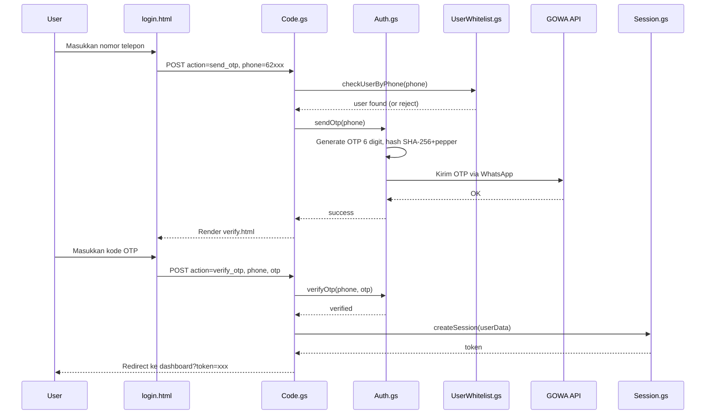
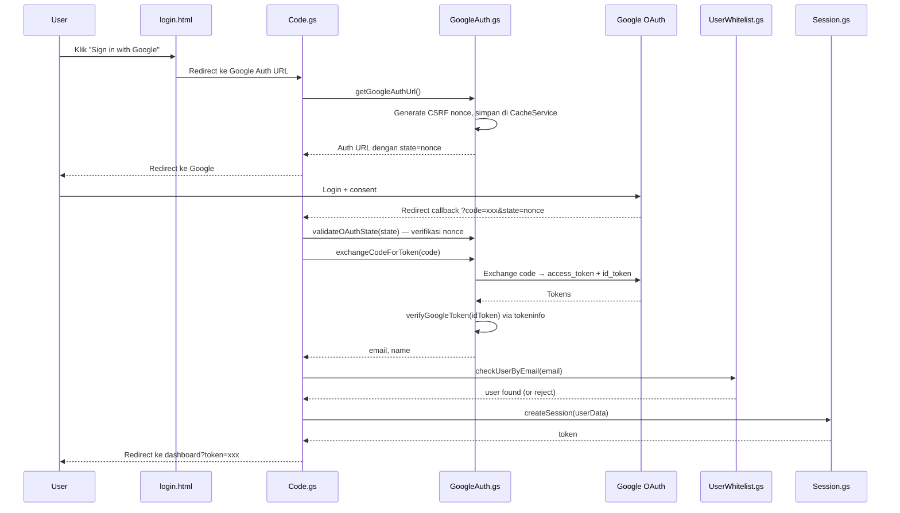

# Arsitektur GAS Workspace Hub

Dokumen ini menjelaskan arsitektur sistem Auth Hub untuk developer yang ingin memahami, menggunakan, atau berkontribusi ke project.

---

## Diagram Arsitektur

```mermaid
graph TB
    subgraph "Auth Hub (GAS Project)"
        CodeGS["Code.gs<br/>doGet() / doPost()"]
        AuthGS["Auth.gs<br/>OTP + GOWA API"]
        GoogleAuthGS["GoogleAuth.gs<br/>OAuth 2.0"]
        SessionGS["Session.gs"]
        UserWhitelistGS["UserWhitelist.gs"]
        AppRegistryGS["AppRegistry.gs"]
        AdminAPIGS["AdminAPI.gs"]
        AuditLogGS["AuditLog.gs"]
        TriggersGS["Triggers.gs"]
        SetupGS["Setup.gs"]

        LoginHTML["login.html"]
        VerifyHTML["verify.html"]
        DashboardHTML["dashboard.html"]
        AdminHTML["admin.html"]
        ProfileHTML["profile.html"]
        NavbarHTML["_navbar.html + _navbar_styles.html"]
    end

    subgraph "Data Store (Google Spreadsheet)"
        UsersTab["Tab: users"]
        SessionsTab["Tab: sessions"]
        AppsTab["Tab: apps"]
        AuditTab["Tab: audit_log"]
    end

    subgraph "External Services"
        GOWA["GOWA WhatsApp API"]
        GoogleOAuth["Google OAuth 2.0"]
    end

    subgraph "Child App (GAS Project terpisah)"
        ChildApp["doGet(e)"]
        GasAuthLib["GasAuthLib.authenticate(e)"]
    end

    CodeGS --> AuthGS
    CodeGS --> GoogleAuthGS
    CodeGS --> SessionGS
    CodeGS --> UserWhitelistGS
    CodeGS --> AppRegistryGS
    CodeGS --> AdminAPIGS
    CodeGS --> AuditLogGS
    CodeGS --> LoginHTML
    CodeGS --> VerifyHTML
    CodeGS --> DashboardHTML
    CodeGS --> AdminHTML
    CodeGS --> ProfileHTML

    DashboardHTML --> NavbarHTML
    AdminHTML --> NavbarHTML
    ProfileHTML --> NavbarHTML

    AuthGS --> GOWA
    GoogleAuthGS --> GoogleOAuth

    SessionGS --> SessionsTab
    UserWhitelistGS --> UsersTab
    AppRegistryGS --> AppsTab
    AuditLogGS --> AuditTab
    AdminAPIGS --> UsersTab
    AdminAPIGS --> AppsTab
    TriggersGS --> SessionGS
    TriggersGS --> AuditLogGS

    ChildApp --> GasAuthLib
    GasAuthLib --> SessionsTab
    GasAuthLib -.->|redirect jika belum login| CodeGS
```



---

## Komponen Utama

### Backend (.gs files)

| File | Peran |
|:-----|:------|
| `Code.gs` | Controller utama — routing `doGet(e)` dan `doPost(e)`, render halaman HTML, dispatch ke modul lain. |
| `Auth.gs` | Modul OTP WhatsApp — generate OTP 6 digit, hash SHA-256 + pepper, kirim via GOWA API, verifikasi dengan rate limiting. |
| `GoogleAuth.gs` | Google OAuth 2.0 Authorization Code flow — build auth URL, exchange code for token, verify ID token via tokeninfo endpoint. |
| `UserWhitelist.gs` | Lookup user dari Google Sheet tab `users` — cek by email dan by phone, normalisasi case-insensitive. |
| `Session.gs` | Session management terpusat — create session token (SHA-256 hash UUID), validate, delete, cleanup expired. TTL 1 jam. |
| `AppRegistry.gs` | Registry aplikasi dari tab `apps` — role-based filtering, kategori, build app URL dengan token. |
| `AdminAPI.gs` | Backend CRUD admin panel — manage users & apps, validasi admin via `requireAdmin()`, audit logging. |
| `AuditLog.gs` | Pencatatan aktivitas (login, logout, admin ops) ke tab `audit_log`. Cleanup > 90 hari. |
| `Triggers.gs` | Setup time-driven triggers — `scheduledCleanup()` setiap 6 jam (session + audit log). |
| `Setup.gs` | Generator otomatis spreadsheet + tab. Jalankan `setupProductionSheet()` SATU KALI untuk setup awal. |
| `TesKoneksi.gs` | Diagnostik koneksi ke API GOWA (Basic Auth). |

### Frontend (.html files)

| File | Peran |
|:-----|:------|
| `login.html` | Halaman login — dual mode: "Sign in with Google" (OAuth redirect) + form OTP WhatsApp. |
| `verify.html` | Input verifikasi OTP 6 digit + countdown timer. |
| `dashboard.html` | Dashboard hub — category pill bar, 2-column app grid, compact header, bottom navigation. |
| `admin.html` | Admin panel — pill tabs (Users/Apps), CRUD via `google.script.run` ke `AdminAPI.gs`. |
| `profile.html` | Profil user — informasi session aktif + tombol logout. |
| `_navbar.html` | Bottom navigation bar component — JavaScript-based, membaca data dari `window.__HUB__`. |
| `_navbar_styles.html` | CSS untuk bottom navigation dan pill tabs. |

### Auth Library (untuk child apps)

| File | Lokasi | Peran |
|:-----|:-------|:------|
| `AuthMiddleware.gs` | `lib/gas-auth-lib/` | Library utama — `authenticate(e)`, `hasRole()`, `buildSafeRedirectPage()`, `escapeHtmlAttr()`. |
| `ChildAppTemplate.gs` | `lib/gas-auth-lib/` | Template contoh implementasi `doGet(e)` di child app. |

---

## Data Flow

### Request Flow (User → Hub → Response)

```
User browser
  │
  ├─ GET /?token=xxx ──→ Code.gs doGet(e)
  │                        ├─ validateSession(token) → Session.gs → Sheet 'sessions'
  │                        ├─ getRegisteredApps(role) → AppRegistry.gs → Sheet 'apps'
  │                        └─ render dashboard.html / admin.html / profile.html
  │
  ├─ GET / (no token) ──→ Code.gs doGet(e) → render login.html
  │
  ├─ GET /?code=xxx ───→ Code.gs doGet(e) → Google OAuth callback
  │                        ├─ exchangeCodeForToken(code) → Google token endpoint
  │                        ├─ verifyGoogleToken(idToken) → Google tokeninfo
  │                        ├─ checkUserByEmail(email) → UserWhitelist.gs → Sheet 'users'
  │                        ├─ createSession(userData) → Session.gs → Sheet 'sessions'
  │                        └─ redirect ke dashboard dengan ?token=xxx
  │
  ├─ POST action=send_otp ──→ Auth.gs sendOtp() → GOWA API (WhatsApp)
  ├─ POST action=verify_otp ─→ Auth.gs verifyOtp() → create session → redirect dashboard
  ├─ POST action=logout ─────→ Session.gs deleteSession() → render login
  └─ POST action=admin_* ────→ AdminAPI.gs (requireAdmin → CRUD → Sheet)
```

### Admin Panel Data Flow

```
admin.html (browser)
  │
  ├─ google.script.run.adminGetUsers(token)   → AdminAPI.gs → Sheet 'users'
  ├─ google.script.run.adminAddUser(token, data)    → AdminAPI.gs → Sheet 'users' + audit_log
  ├─ google.script.run.adminUpdateUser(token, data) → AdminAPI.gs → Sheet 'users' + audit_log
  ├─ google.script.run.adminDeleteUser(token, email)→ AdminAPI.gs → Sheet 'users' + audit_log
  └─ (sama untuk apps: adminGetApps, adminAddApp, adminUpdateApp, adminDeleteApp)
```

---

## Auth Flows

### OTP WhatsApp Flow



### Google OAuth 2.0 Flow



---

## Session Management

- **Token Generation**: SHA-256 hash dari UUID + timestamp + random string.
- **Storage**: Google Sheet tab `sessions` — setiap baris = satu session aktif.
- **TTL**: 1 jam (`SESSION_DURATION_MS = 3600000`). Setelah expired, session tidak valid.
- **Validation**: `validateSession(token)` → lookup token di Sheet, cek expiry, return session data (email, name, role, kelas).
- **Cleanup**: `cleanExpiredSessions()` dijalankan setiap 6 jam via time-driven trigger (`Triggers.gs`). Menghapus baris expired dari bawah ke atas.
- **Cross-project SSO**: Child apps membaca tab `sessions` di Sheet yang sama menggunakan `AUTH_SESSION_SHEET_ID`.

---

## Child App Integration

Child apps (GAS projects terpisah) menggunakan library `lib/gas-auth-lib/` untuk autentikasi:

1. **Deploy library** — `lib/gas-auth-lib/` di-deploy sebagai GAS Library terpisah.
2. **Import di child app** — tambahkan library via Script ID di GAS Editor.
3. **Set Script Properties** di child app:
   - `AUTH_SESSION_SHEET_ID` — Sheet ID yang sama dengan `USERS_SHEET_ID` hub
   - `AUTH_HUB_URL` — URL deployment Auth Hub
4. **Panggil di `doGet(e)`**:
   ```javascript
   function doGet(e) {
     var auth = GasAuthLib.authenticate(e);
     if (auth.redirect) return auth.redirect; // belum login → redirect ke hub
     // auth.email, auth.name, auth.role tersedia
   }
   ```
5. **Cek role** (opsional): `GasAuthLib.hasRole(auth, 'guru')` — support comma-separated roles.

### Flow:
```
User → Child App doGet(e)
  → GasAuthLib.authenticate(e)
    → Cek ?token= di URL
    → Validasi token di Sheet 'sessions'
    → Jika valid → return session data
    → Jika tidak valid → redirect ke Auth Hub login page
```

---

## Admin Panel

`admin.html` adalah halaman admin yang memungkinkan user dengan role `admin` mengelola users dan apps.

### Arsitektur Client-Server

- **Client**: `admin.html` menggunakan `google.script.run` untuk memanggil fungsi di `AdminAPI.gs` secara asinkron.
- **Server**: `AdminAPI.gs` memvalidasi setiap request via `requireAdmin(token)` — cek session token dan pastikan role = admin.
- **Audit**: Setiap operasi CRUD di-log ke tab `audit_log` via `AuditLog.gs`.

### Validasi

- Role harus salah satu dari `VALID_ROLES`: `admin`, `kepsek`, `guru`, `orangtua`, `siswa`.
- Email bersifat unik (primary key) — tidak bisa diubah setelah user ditambahkan.
- Semua validasi dilakukan server-side di `AdminAPI.gs`.
