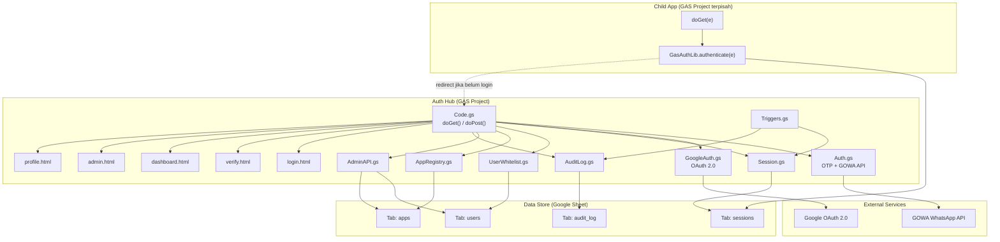

# Project Overview

> Sumber kebenaran bagi Devin untuk memahami repo `gas-workspace-hub`.

---

## Tujuan Repo

**Auth Hub** — Sistem autentikasi terpusat (Single Sign-On) untuk ekosistem Google Apps Script (GAS) web applications. Menyediakan:

- **Login OTP WhatsApp** via GOWA API
- **Login Google OAuth 2.0** (Authorization Code flow)
- **Session management** terpusat di Google Sheet
- **App registry** dengan role-based access control
- **Dashboard hub** untuk navigasi ke child apps
- **Admin panel** untuk CRUD users & apps
- **Auth Library** reusable untuk child apps

---

## Arsitektur

### Struktur Project

```
gas-workspace-hub/
├── *.gs, *.html          ← Satu GAS project (Auth Hub)
├── appsscript.json       ← Manifest hub
├── lib/gas-auth-lib/     ← GAS Library TERPISAH (project sendiri)
│   ├── AuthMiddleware.gs
│   ├── ChildAppTemplate.gs
│   ├── README.md
│   └── appsscript.json
├── docs/
│   ├── sync-guide.md
│   └── devin/            ← Dokumentasi Devin
└── .github/workflows/    ← GitHub Actions (auto-merge)
```

- **Root (flat `.gs` files)** = satu GAS project — Auth Hub
- **`lib/gas-auth-lib/`** = GAS Library terpisah — di-deploy sebagai library dan diimport oleh child apps
- Masing-masing punya `.clasp.json` sendiri (keduanya di-gitignore)

### Diagram Arsitektur



---

## Entry Points

### `doGet(e)` — `Code.gs:12`

Routing GET:
1. `?token=xxx` valid → dashboard / admin / profile page
2. `?token=xxx` valid + `?redirect=URL` → redirect ke child app
3. `?code=xxx` → Google OAuth callback
4. Default → login page

### `doPost(e)` — `Code.gs:143`

Routing POST:
- `action=logout` → invalidasi session
- `action=send_otp` → kirim OTP WhatsApp
- `action=verify_otp` → verifikasi OTP
- `action=admin_*` → Admin API CRUD (users & apps)
- `action=google_login` → deprecated legacy flow

---

## Data Store

Semua data disimpan di **satu Google Spreadsheet** (ID di Script Property `USERS_SHEET_ID`):

| Tab | Kolom | Fungsi |
|:----|:------|:-------|
| `users` | email, phone, nama, role, status, ditambahkan_oleh, tanggal, kelas, apps | Whitelist user + profile |
| `sessions` | token, email, phone, name, role, loginMethod, createdAt, expiresAt, status, kelas | Session aktif (TTL 1 jam) |
| `apps` | id, name, url, icon, description, allowedRoles, status, category | Registry child apps |
| `audit_log` | timestamp, event, email, phone, method, detail | Log aktivitas (retensi 90 hari) |

---

## External Services

| Service | Digunakan oleh | Fungsi |
|:--------|:---------------|:-------|
| **GOWA WhatsApp API** (`wa.dimanaaja.biz.id`) | `Auth.gs` | Kirim OTP via WhatsApp. Basic Auth (`GOWA_API_KEY`). |
| **Google OAuth 2.0** | `GoogleAuth.gs` | Login via akun Google. Auth Code flow + ID token verification. |

---

## Script Properties (Hub)

| Property | Sumber | Deskripsi |
|:---------|:-------|:----------|
| `USERS_SHEET_ID` | Auto-generated oleh `setupProductionSheet()` | ID Google Spreadsheet utama |
| `DEFAULT_ADMIN_EMAIL` | Manual (sebelum setup) | Email admin default |
| `DEFAULT_ADMIN_PHONE` | Manual (sebelum setup) | Nomor WA admin default (format 62xxx) |
| `GOWA_API_KEY` | Manual | Kredensial GOWA API (format `username:password`) |
| `OTP_SECRET_PEPPER` | Manual | Pepper untuk hashing OTP (rahasia) |
| `GOOGLE_CLIENT_ID` | Manual (opsional) | Google OAuth Client ID |
| `GOOGLE_CLIENT_SECRET` | Manual (opsional) | Google OAuth Client Secret |
| `TEST_SHEET_ID` | Auto-generated oleh `setupTestSheet()` | ID Spreadsheet test (terpisah dari production) |

### Script Properties (Child Apps)

| Property | Deskripsi |
|:---------|:----------|
| `AUTH_SESSION_SHEET_ID` | Sheet ID yang **sama** dengan `USERS_SHEET_ID` hub (berisi tab `sessions`) |
| `AUTH_HUB_URL` | URL deployment Auth Hub webapp |

---

## Catatan Penting untuk Devin

1. **`.clasp.json` sengaja di-gitignore.** Devin tidak perlu tahu Script ID production. Jangan pernah membuat atau mengubah file ini.

2. **Setup awal sudah dilakukan.** `setupProductionSheet()` dan `setupTestSheet()` sudah dijalankan oleh user. **JANGAN jalankan ulang** — akan membuat spreadsheet duplikat.

3. **Tidak ada CLI test runner.** Semua test dijalankan via `runAllTests()` di GAS Editor. Setelah menulis test, instruksikan user untuk menjalankannya.

4. **Tidak ada npm, package.json, atau build step.** Project ini murni Google Apps Script.

5. **Roles yang valid:** `admin`, `kepsek`, `guru`, `orangtua`, `siswa` (didefinisikan di `AdminAPI.gs` sebagai `VALID_ROLES`).

---

## Branch Naming Convention

| Pattern | Penggunaan |
|:--------|:-----------|
| `main` | Branch stabil — target semua PR |
| `devin/task-<id>-<slug>` | Implementasi fitur/fix oleh Devin |
| `review/bug-<id>-<slug>` | Investigasi bug oleh Devin |
| `docs/<topic>` | Perubahan dokumentasi saja |

## PR Format (Draft PR)

- **Title:** `[type] deskripsi singkat` (contoh: `[feat] tambah CSRF token untuk Admin API`)
- **Body harus berisi:**
  - Tujuan perubahan
  - File utama yang diubah
  - Area risiko yang tersentuh (referensi `risk-register.md`)
  - Test yang perlu dijalankan user di GAS Editor
  - Langkah verifikasi setelah merge (clasp push, deploy ulang, dll)
- Label area risiko jika menyentuh file HIGH risk

## Auto-Merge Rules

### BOLEH di-auto-merge:
- Perubahan docs-only (file `.md`)
- Typo fix
- File non-`.gs` (kecuali `.html` yang berisi logic)

### TIDAK BOLEH di-auto-merge:
- Perubahan di `Auth.gs`, `GoogleAuth.gs`, `Code.gs` (Admin API section), `Session.gs`
- Perubahan di `lib/gas-auth-lib/` (blast radius tinggi)
- Perubahan yang menambah/mengubah usage Script Properties
- PR tanpa test coverage (minimal ada test case baru di `Test_*.gs`)

### Mekanisme Teknis

Auto-merge diatur oleh `.github/workflows/auto-merge-devin.yml`:
- Semua Devin PR otomatis di-approve
- Auto-merge HANYA berjalan jika:
  - Title PR tidak mengandung `[HIGH-RISK]`
  - File yang diubah tidak termasuk area HIGH risk

### Instruksi untuk Devin:
- Jika task menyentuh file HIGH risk, tambahkan `[HIGH-RISK]` di awal title PR
- Contoh: `[HIGH-RISK][fix] perbaiki rate limiting di Auth.gs`
